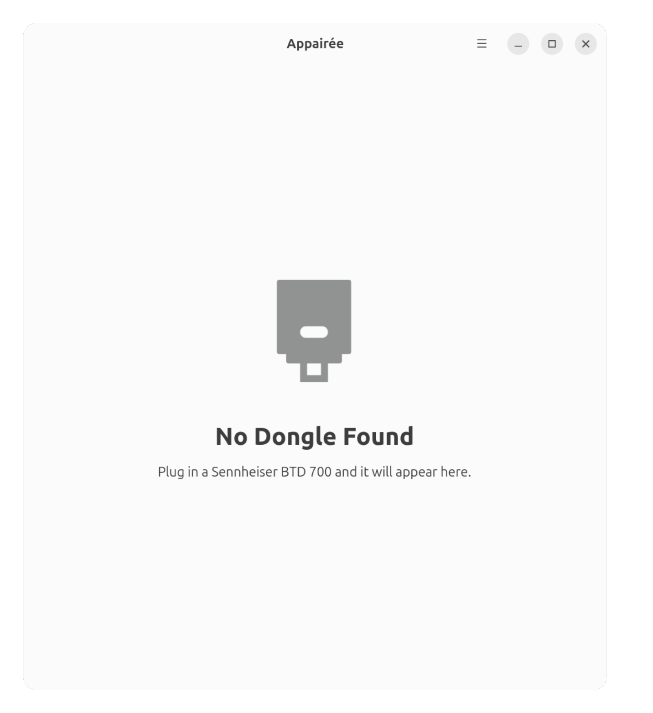

# Appairée

A GNOME application for the **Sennheiser BTD 700** Bluetooth USB dongle.

> **appairé** \\a.pɛ.ʁe\\  
> French, adjective, joined or grouped with another because it shares similar characteristics.

Appairée is a front-end for [btd700ctl](https://github.com/sobalap/btd700ctl) by
**sobalap**, which does all of the real work: reverse-engineering the dongle's
vendor HID protocol and implementing it. Appairée only puts a window in front of it.

btd700ctl is vendored unmodified under [`src/btd700ctl/`](src/btd700ctl/), so there is
nothing to install separately — see the README there for the commit and the licence.



## Why

The BTD 700 needs no driver on Linux — the kernel already treats it as an ordinary
USB sound card. What no Linux software can reach are the settings stored *inside the
dongle's own firmware*, which Sennheiser exposes only through its Windows and macOS
"Dongle Control" application:

- **Audio mode** — high quality, gaming (low latency), or Auracast broadcasting
- **Codec** — SBC, aptX, aptX Adaptive, aptX Lossless, LC3, depending on what the
  dongle and your headphones both support

These live in the dongle, not on the computer, so they follow it from machine to machine.

The main window shows the dongle's **status light** as it looks on the hardware, lit in
the colour it is showing right now and blinking in the same pattern, above the two
settings and the live status readings. The window itself stays bare — every row explains
what it means, and what other values it can take, in its tooltip.

The menu holds **About Dongle** (model, firmware, serial number) and a **Manual** that
reproduces two things the printed manual scatters across a dozen pages: the complete
status LED colour legend, with the row the dongle is currently showing marked live, and
every gesture of the dongle's single button.

## Languages

English, French, German, Spanish, Italian and Dutch. The interface follows the system
language, and can be changed from the menu at any time without restarting.

## Installing

### Debian and Ubuntu

Recommended. The package installs the udev rule Appairée needs, as root, at install
time: install it, plug in the dongle, done. Nothing to copy and nothing to configure.

```bash
curl -L -o /tmp/appairee.deb \
    https://github.com/benjaminbellamy/appairee/releases/download/1.0.0/appairee_1.0.0_amd64.deb \
    && sudo apt install /tmp/appairee.deb
```

### Flatpak

Any distribution, at the cost of the udev rule: a Flatpak cannot write to `/etc` or
`/usr/lib`, so the rule has to be installed by hand. Appairée shows the exact command,
with the right path already filled in, when it cannot reach the dongle.

```bash
curl -L -o /tmp/appairee.flatpak \
    https://github.com/benjaminbellamy/appairee/releases/download/1.0.0/appairee-1.0.0.flatpak \
    && flatpak install --user --bundle /tmp/appairee.flatpak
```

## Uninstalling

```bash
sudo apt remove appairee                              # Debian package
flatpak uninstall --user fr.benjaminbellamy.Appairee  # Flatpak
```

Removing the Debian package removes its udev rule with it. A rule you installed by
hand for the Flatpak is yours, and stays until you delete it:

```bash
sudo rm /etc/udev/rules.d/99-btd700.rules
sudo udevadm control --reload-rules
```

## Building from source

Needs `gtk4`, `libadwaita-1`, `hidapi-hidraw`, `blueprint-compiler` and `meson`.
Nothing else — btd700ctl is built from the vendored copy under `src/btd700ctl/`.

```bash
meson setup build -Dudev_rules_dir=/usr/lib/udev/rules.d
meson compile -C build
meson test -C build
sudo meson install -C build
```

Leave `udev_rules_dir` unset for an uninstalled build; then see below.

To build the packages instead:

```bash
./build-aux/deb/build-deb.sh                 # a .deb, udev rule included
./build-aux/flatpak/build-bundle.sh          # a single-file .flatpak bundle
```

## The udev rule

`/dev/hidraw*` belongs to root. Without a udev rule granting access, **no** application
— Appairée, a terminal, anything — can talk to the dongle as a normal user. This is a
property of Linux, not of how Appairée is packaged.

The Debian package installs the rule itself. For any other install, copy it once:

```bash
sudo cp data/99-btd700.rules /etc/udev/rules.d/
sudo udevadm control --reload-rules
sudo udevadm trigger
```

Then unplug and replug the dongle. Installed copies of the file live at
`/usr/share/appairee/99-btd700.rules`.

The USB portal, which exists precisely so sandboxed applications can reach devices
without this, does not help here: it brokers access you already have rather than
granting it, and reports the dongle as read-only because nothing gives the user write
access to it in the first place. It would replace this udev rule with a different one.

## Sandbox permissions

The Flatpak requests `--device=all`. btd700ctl talks to the dongle through hidapi's
hidraw backend, which opens `/dev/hidrawN` directly, and no narrower Flatpak permission
exposes those nodes.

## Not included

Firmware updates (Sennheiser ships them only for Windows and macOS), Auracast
broadcast configuration, factory reset, and PipeWire sink switching — btd700ctl's own
`btd700d` daemon already does the last one, and two programs writing the default sink
would fight over it.

## Licence

GPL-3.0-or-later. See [LICENSE](LICENSE).

btd700ctl, which Appairée links against, is LGPL-2.1 and remains so; its terms are
unaffected by the licence of this application.

Appairée is an independent project. It is not affiliated with, endorsed by, or
supported by Sennheiser or Sonova Consumer Hearing GmbH.
